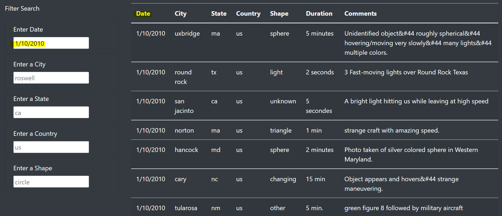
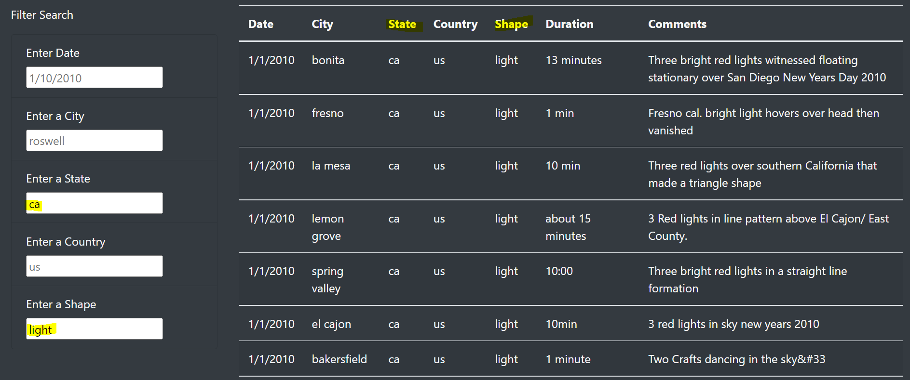
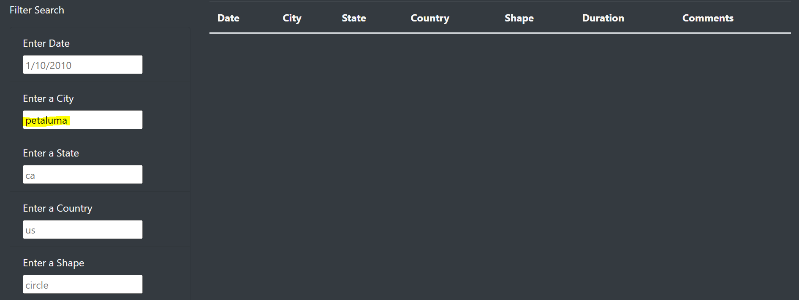

# **Module 11 Challenge: UFO Sightings Webpage**

## *Overview*

The purpose of this analysis is to create a webpage that visualizes UFO sightings data using a dynamic table that allows users to search for multiple criteria at the same time: city, state, country, and shape.

## *Results*

The webpage now filters and displays the UFO sightings data automatically in the table as the user inputs one or more search criterion in the provided boxes. 

#### *One Search Criterion:*
For example, if the user searches for 1/10/2010 then the table displays UFO sightings for that date only:

#### *Multiple Search Criteria:*

In another example, the user could search for UFO sightings in the state of California with a "light" shape:

#### *No Results:*

If the user searches for data that is not in the UFO sightings dataset, nothing is displayed in the table:

## *Summary*
One drawback of the new webpage design is the lack of a "search" button next to the search input fields. This may confuse some users, since most webpages include a "search" button with their serach input field(s) that clearly communicates to the user that the "search" action will occur. 

Here are two other recommendations for further UFO sightings webpage development:
- The table displays "No Results" when the user searches for data that is not in the UFO sightings dataset.
- The webpage includes a web form that allows users to submit their own citizen-scientist UFO sighting data.

